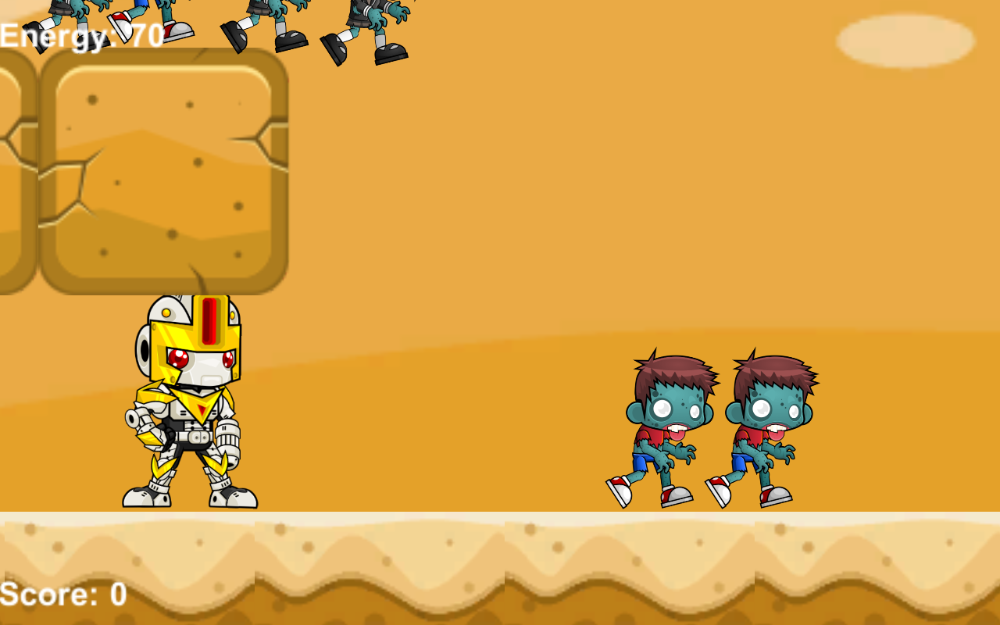
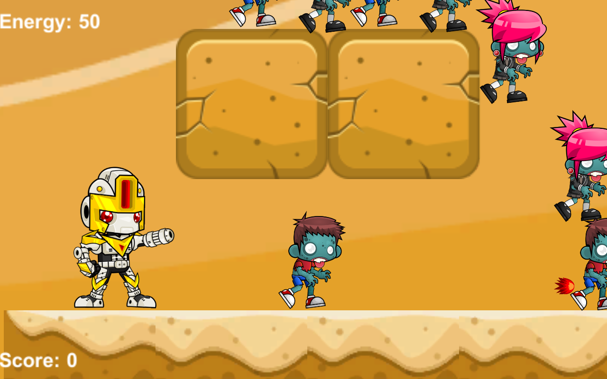
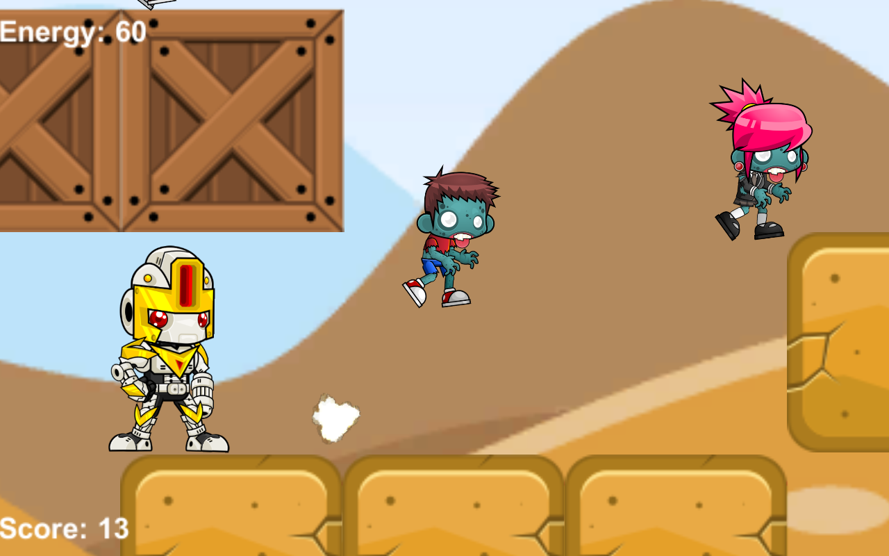
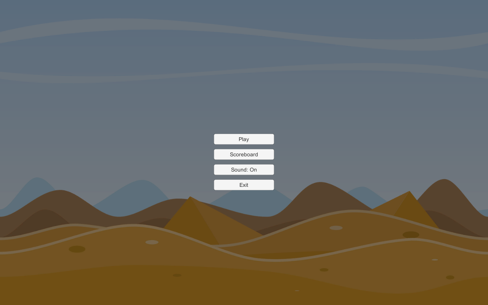
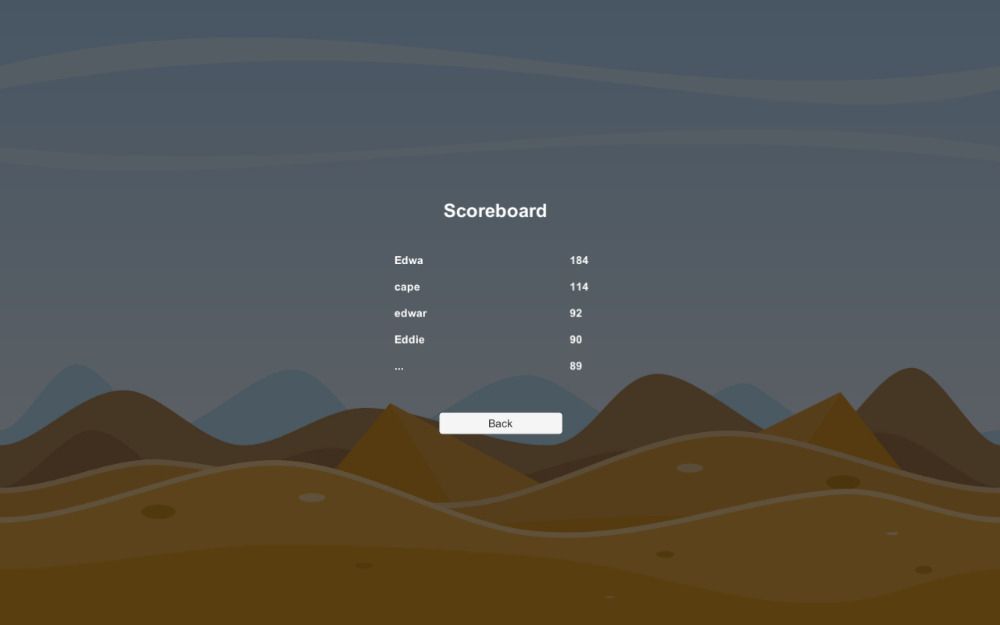
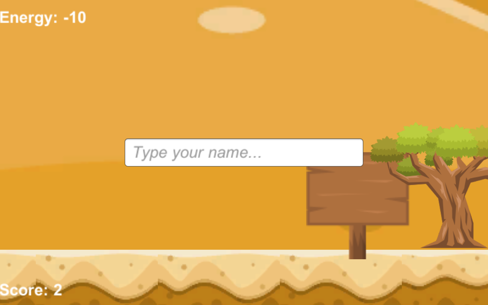
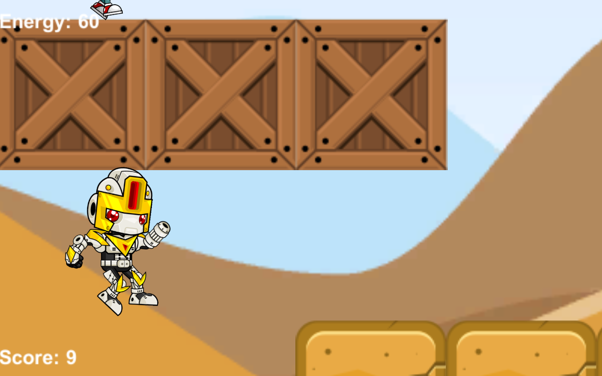
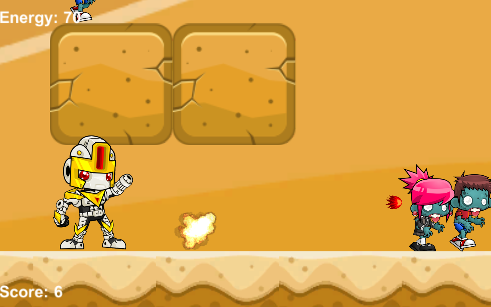

# IF3210-2020-Unity-13517115
## Deskripsi Aplikasi
- Aplikasi yang dibuat merupakan game desktop yang dibuat dengan Unity. Game ini terdiri dari sebuah karakter utama yang bisa menggunakan dua jenis senjata dan dua jenis musuh yang mengikuti karakter utama dan di-spawn pada posisi pseudo-random pada game. Pseudo-random yang dimaksud adalah random, namun posisi spawn adalah di sebelah kanan karakter.
## Cara Kerja
Berikut adalah cara kerja yang diurutkan berdasarkan spesifikasi wajib dan bonus:
#### Spesifikasi wajib:
- (a) dan (b): Terdapat karakter utama yang dapat berjalan ke kiri jika pengguna menekan tombol panah kiri. Karakter utama dapat juga berjalan ke kanan jika pengguna menekan tombol panah kanan. Jika pengguna menekan tombol spasi, karakter utama akan menembakan peluru kepada musuh. Jika pengguna menekan tombol enter, karakter utama akan menembakan roket api kepada musuh. Jika pengguna menekan tombol "W", karakter utama akan melompat. Karakter utama memiliki BoxCollider2D dan RigidBody2D sehingga bergerak mengikuti hukum fisika.
- (c): Saat pengguna menekan tombol spasi, akan dikeluarkan suara tembakan pistol. Saat pengguna menekan tombol enter, akan dikeluarkan suara tembakan misil. Perhatikan bahwa suara dikeluarkan jika pengaturan suara sudah dinyalakan.
- (d): Kamera selalu mengikuti pergerakan karakter. Untuk mengujinya, gerakan karakter ke kanan atau ke kiri atau ke atas (lompat).
- (e): Terdapat animasi yang dimainkan ketika karakter bergerak ke arah kanan atau bergerak ke arah kiri, saat karakter menembak, saat karakter melompat, dan saat karakter diam.
- (f): Terdapat dua jenis zombie yang digenerate, yaitu zombie pria dan zombie wanita. Zombie tersebut bergerak ke arah karakter dan jika bersentuhan, darah pemain berkurang sebanyak 10 poin. Jika zombie tersebut mati, zombie tersebut akan di-spawn pada posisi pseudo-random pada game. Terdapat 10 zombie pada satu waktu untuk menyerang karakter.
- (g): Karakter memiliki darah bernilai 100. Dimunculkan text "Energy: <darah>" di posisi kiri atas kamera. Jika darah pemain mencapai 0, permainan berhenti.
- (h): Desain peta dari game dapat dilihat pada bagian screenshot pada laporan ini.
- (i): Game menyimpan score dari pemain. Ketika game mulai, score awalnya adalah 0. Namun jika karakter berhasil membunuh zombie, score akan ditambah dengan jumlah zombie yang dibunuh. Score tersebut ditampilkan di posisi kiri bawah kamera.
- (j): Jika darah pemain mencapai 0, permainan berhenti dan akan dimunculkan Input Field pada kamera. Pengguna dapat mengisi input field tersebut dengan mengetikan username. Untuk menyimpan pada basis data online, tekan enter setelah beres mengetik. Jika sudah menekan enter dan response dari server adalah "OK", akan dimunculkan scene MainMenu.
- (k): 
  - Ketika game dimulai, Scene MainMenu dimunculkan terlebih dahulu. Pada MainMenu terdapat berbagai tombol, yaitu tombol "Play", tombol "Scoreboard", tombol "Sound: On" atau "Sound Off", dan tombol "Exit".
  - Jika pengguna menekan tombol "Play", scene Game akan dimunculkan. Jika pengguna menekan tombol "Scoreboard", scene Scorebord akan dimunculkan. Jika pengguna menekan tombol "Sound: On", maka text pada tombol akan berubah menjadi "Sound: Off" dan audio tidak akan dimainkan. Jika pengguna menekan tombol "Sound: Off", maka text pada tombol akan berubah menjadi "Sound: On" dan audio dimainkan. Jika pengguna menekan tombol "Exit", game akan dikeluarkan.
  - Scene MainMenu dibuat dengan menggunakan Canvas dan Panel yang memiliki background bernama "BG".
  - Pada Scene Scoreboard, dimunculkan 5 pengguna game yang memiliki skor tertinggi. Scene Scoreboard dibuat dengan menggunakan Canvas dan Panel yang memiliki background bernama "BG".
- (l): PlayerPrefs yang digunakan memiliki key "Sound" dan value bertipe integer yang bernilai 0 atau 1. Jika value bernilai 1, audio akan dijalankan. Jika value bernilai 0, audio tidak akan dijalankan. Untuk mengganti nilai value pada PlayerPrefs, tekan tombol "Sound: On" atau "Sound Off" pada Scene MainMenu.
- (m): Asset yang digunakan diambil dari https://www.gameart2d.com/freebies.html.
- (n): Game dibuat dalam aplikasi desktop. Pada folder yang terdapat README.md, terdapat file bernama "Game-13517115". Klik dan jalankan!
#### Spesifikasi bonus:
- (1): Jika pengguna menekan tombol spasi, karakter utama akan menembakan peluru kepada musuh. Jika peluru mengenai zombie pria, darah zombie akan dikurangi sebanyak 6. Jika peluru mengenai zombie wanita, darah zombie akan dikurangi sebanyak 3. Jika pengguna menekan tombol enter, karakter utama akan menembakan roket api kepada musuh. Jika roket api mengenai zombie pria maupun zombie wanita, zombie tersebut akan mati seketika. Jika pengguna sudah menggunakan roket api, diperlukan 8 detik agar roket api dapat ditembak kembali. Namun, selama 8 detik tersebut, roket api akan tetap menyala pada game (tidak dihide). Jika zombie pria maupun zombie wanit mengenai roket api yang tidak dihide tersebut, ia tetap akan mati seketika.
- (2): Terdapat zombie pria dan zombie wanita yang memiliki darah sama-sama 30. Namun, jika peluru mengenai zombie pria, darah zombie akan dikurangi sebanyak 6. Jika peluru mengenai zombie wanita, darah zombie akan dikurangi sebanyak 3.
- (3): Object pooling dilakukan pada peluru, roket api dan zombie. Pada peluru, object pool berisi tiga peluru. Pada zombie, object pool berisi satu roket api. Pada zombie, object pool berisi 10 zombie.
## Library yang digunakan dan Justifikasi penggunaan
- Library yang digunakan pada tugas besar ini adalah RestClient (link: https://github.com/proyecto26/RestClient).
- Library ini memudahkan programmer untuk melakukan HTTP request pada basis data online. Jika tidak menggunakan library, mekanisme HTTP request harus dibuat sendiri dengan menggunakan Callback dan CoRoutine pada Unity dan tentunya rumit untuk dibuat. Spesifikasi dari tugas ini tidak mewajibkan mahasiswa untuk tidak menggunakan library pada HTTP request sehingga perilaku penggunaan Library ini tidak dapat disalahkan.
## Screenshot Aplikasi

